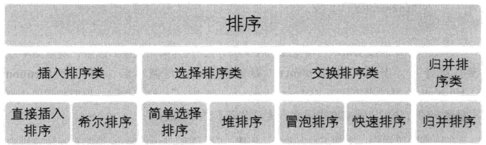
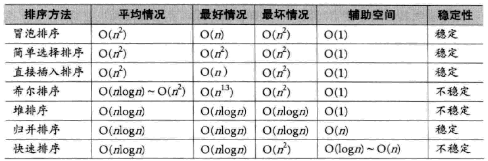

来自https://www.cnblogs.com/feixuelove1009/p/6143539.html
##一、排序的基本概念和分类
所谓排序，就是使一串记录，按照其中的某个或某些关键字的大小，递增或递减的排列起来的操作。排序算法，就是如何使得记录按照要求排列的方法。

排序的稳定性：
经过某种排序后，如果两个记录序号同等，且两者在原无序记录中的先后秩序依然保持不变，则称所使用的排序方法是稳定的，反之是不稳定的。

内排序和外排序
内排序：排序过程中，待排序的所有记录全部放在内存中
外排序：排序过程中，使用到了外部存储。
通常讨论的都是内排序。

影响内排序算法性能的三个因素：

时间复杂度：即时间性能，高效率的排序算法应该是具有尽可能少的关键字比较次数和记录的移动次数
空间复杂度：主要是执行算法所需要的辅助空间，越少越好。
算法复杂性。主要是指代码的复杂性。
根据排序过程中借助的主要操作，可把内排序分为：

插入排序
交换排序
选择排序
归并排序
按照算法复杂度可分为两类：

简单算法：包括冒泡排序、简单选择排序和直接插入排序
改进算法：包括希尔排序、堆排序、归并排序和快速排序
以下的七种排序算法只是所有排序算法中最经典的几种，不代表全部。
冒泡排序 -> 快速排序
简单选择排序 -> 堆排序
直接插入买需 -> 希尔排序

## 快速排序
1.快速排序的时间性能取决于递归的深度
2.当pivot_key恰好处于记录关键码的中间值时，大小两区的划分比较均衡，接近一个平衡二叉树，
此时的时间复杂度为o(nlog(n))
3.当原记录集合是一个正序或者逆序的情况下，分区的结果就是一颗斜树，其深度为n-1,每一次执行
大小分区，都要使用n-i此比较，其最终时间复杂度为o(n^2)
4.在一般情况下，通过数学归纳法可证明，快速排序的时间复杂度为o(nlog(n))
5.但是由于关键字的比较和交换是跳跃式的，因此，快速排序是一种不稳定排序。
6.同时由于采用的递归技术，该算法需要一定的辅助空间，其空间复杂度o(logn)

some notes
1.数据过万，冒泡算法基本不可用。测试时间忠实的反映了n平方的时间复杂度，数据扩大10倍，耗时增加100倍
2.对于Python的列表，反序遍历比正序遍历还是要消耗一定的时间的
3.快速排序在数据较大时，其威力显现，但不够稳定，总体还是维护了nlog(n)的复杂度。

### 基本的快速排序还有可以优化的地方：

1. 优化选取的pivot_key
前面我们每次选取pivot_key的都是子序列的第一个元素，也就是lis[low]，这就比较看运气。运气好时，该值处于整个序列的靠近中间值，则构造的树比较平衡，运气比较差，处于最大或最小位置附近则构造的树接近斜树。
为了保证pivot_key选取的尽可能适中，采取选取序列左中右三个特殊位置的值中，处于中间值的那个数为pivot_key，通常会比直接用lis[low]要好一点。在代码中，在原来的pivot_key = lis[low]这一行前面增加下面的代码：
```python
m = low + int((high-low)/2)
if lis[low] > lis[high]:
    self.swap(low, high)
if lis[m] > lis[high]:
    self.swap(high, m)
if lis[m] > lis[low]:
    self.swap(m, low)
```

如果觉得这样还不够好，还可以将整个序列先划分为3部分，每一部分求出个pivot_key，再对3个pivot_key再做一次上面的比较得出最终的pivot_key。这时的pivot_key应该很大概率是一个比较靠谱的值。

2.减少不必要的交换
原来的代码中pivot_key这个记录总是再不断的交换中，其实这是没必要的，完全可以将它暂存在某个临时变量中，如下所示：
```python
def partition(self, low, high):
        
        lis = self.r

        m = low + int((high-low)/2)
        if lis[low] > lis[high]:
            self.swap(low, high)
        if lis[m] > lis[high]:
            self.swap(high, m)
        if lis[m] > lis[low]:
            self.swap(m, low)

        pivot_key = lis[low]
        # temp暂存pivot_key的值
        temp = pivot_key
        while low < high:
            while low < high and lis[high] >= pivot_key:
                high -= 1
            # 直接替换，而不交换了
            lis[low] = lis[high]
            while low < high and lis[low] <= pivot_key:
                low += 1
            lis[high] = lis[low]
            lis[low] = temp
        return low
```
3.优化小数组时的排序
快速排序算法的递归操作在进行大量数据排序时，其开销能被接受，速度较快。但进行小数组排序时则不如直接插入排序来得快，也就是杀鸡用牛刀，未必就比菜刀来得快。
因此，一种很朴素的做法就是根据数据的多少，做个使用哪种算法的选择而已，如下改写qsort方法：
```python
def qsort(self, low, high):
    """根据序列长短，选择使用快速排序还是简单插入排序"""
    # 7是一个经验值，可根据实际情况自行决定该数值。
    MAX_LENGTH = 7
    if high-low < MAX_LENGTH:
        if low < high:
            pivot = self.partition(low, high)
            self.qsort(low, pivot - 1)
            self.qsort(pivot + 1, high)
    else:
        # insert_sort方法是我们前面写过的简单插入排序算法
        self.insert_sort()
```
4.优化递归操作
可以采用尾递归的方式对整个算法的递归操作进行优化，改写qsort方法如下：
```python
def qsort(self, low, high):
    """根据序列长短，选择使用快速排序还是简单插入排序"""
    # 7是一个经验值，可根据实际情况自行决定该数值。
    MAX_LENGTH = 7
    if high-low < MAX_LENGTH:
        # 改用while循环
        while low < high:
            pivot = self.partition(low, high)
            self.qsort(low, pivot - 1)
            # 采用了尾递归的方式
            low = pivot + 1
    else:
        # insert_sort方法是我们前面写过的简单插入排序算法
        self.insert_sort()
```

## 九、排序算法总结
排序算法的分类：


没有十全十美的算法，有有点就会有缺点，即使是快速排序算法，也只是整体性能上的优越，也存在排序不稳定，需要大量辅助空间，不适于少量数据排序等缺点。

**七种排序算法性能对比**



1. 如果待排序列基本有序，请直接使用简单的算法，不要使用复杂的改进算法。
2. 归并排序和快速排序虽然性能高，但是需要更多的辅助空间。其实就是用空间换时间。
3. 待排序列的元素个数越少，就越适合用简单的排序方法；元素个数越多就越适合用改进的排序算法。
4. 简单选择排序虽然在时间性能上不好，但它在空间利用上性能很高。特别适合，那些数据量不大，每条数据的信息量又比较多的一类元素的排序。
